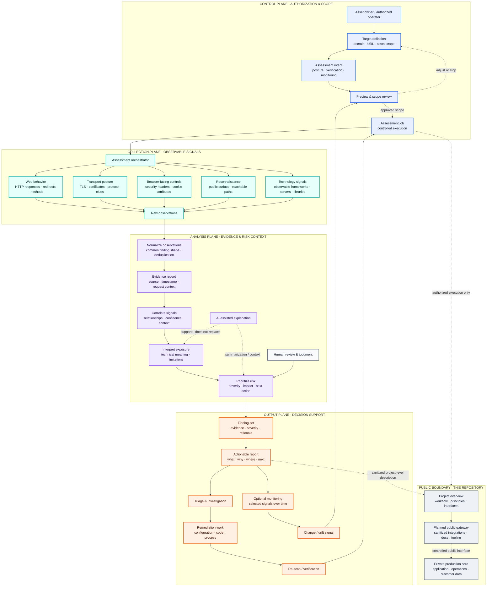

# VulnWatch

### Website vulnerability intelligence for the modern web

VulnWatch is a cybersecurity platform for **authorized website vulnerability scanning, AI-assisted analysis, risk assessment, and actionable security reporting**.

It is designed to turn a complex scan into a clear answer: **what was found, why it matters, and what should be investigated or fixed next.**

> **Explore VulnWatch:** [https://vulnwatch.tech](https://vulnwatch.tech)

---

## Why VulnWatch

Website security information is often fragmented across scanners, logs, dashboards, and technical findings. VulnWatch brings the assessment workflow into one focused experience:

- **Scan** an authorized website or web asset.
- **Understand** findings in plain, structured language.
- **Prioritize** risks that deserve attention first.
- **Review** a useful preview before deciding whether a full report is needed.
- **Monitor** selected security signals over time.

The goal is not to create more noise. The goal is to help people make better-informed security decisions with evidence from their own authorized assets.

## Product capabilities

| Capability | What it is intended to provide |
| --- | --- |
| **Website vulnerability scanning** | A structured assessment of an authorized website and its observable security posture. |
| **AI-assisted analysis** | Context that helps explain technical findings and their practical significance. |
| **Actionable reports** | Findings organized for review, triage, and follow-up work. |
| **Preview-first workflow** | A way to inspect an initial result before obtaining a more complete report. |
| **Security monitoring** | Ongoing monitoring options for selected website and threat-related signals. |
| **Clear user experience** | A scan-first workflow built for both technical and non-specialist readers. |

VulnWatch is an assessment and decision-support platform. It does **not** claim to prove that a website is completely secure or to replace a qualified security review.

## How the platform fits together

The diagram below describes the **public product model** at a technical workflow level. It shows how an authorized assessment can move from scope definition to observable signals, evidence-aware analysis, prioritized output, remediation, and re-assessment. It intentionally avoids exposing private implementation details, internal endpoints, deployment topology, or customer data paths.

### Reading the technical flow

| Layer | Technical responsibility | Example output |
| --- | --- | --- |
| **Control plane** | Establish authorization, target boundaries, scan intent, and an explicit preview checkpoint before execution. | Approved target and assessment scope |
| **Collection plane** | Gather independent signals from observable web, transport, browser-control, reconnaissance, and technology surfaces. | Raw HTTP/TLS/header/recon observations |
| **Analysis plane** | Normalize observations, preserve evidence context, correlate related signals, and add severity and practical interpretation. | Deduplicated, explainable finding candidates |
| **Output plane** | Turn findings into triage-ready reports, remediation actions, re-scan verification, and optional monitoring signals. | Actionable report and follow-up loop |
| **Public boundary** | Keep this repository focused on documentation and safe public interfaces while protecting production implementation and operations. | Curated project overview / future gateway |

A few important details are deliberate in this model:

- **Preview is a control point, not decoration.** It gives the operator an opportunity to inspect scope and intent before a more complete assessment.
- **Signals are not automatically vulnerabilities.** An observation needs context, evidence, and interpretation before it becomes a useful finding.
- **AI is assistive.** It can help summarize and explain signals, but it does not replace authorization checks, evidence review, threat modeling, or qualified human judgment.
- **Risk prioritization is contextual.** Severity and next actions should be interpreted alongside architecture, business impact, exposure, asset importance, and known limitations.
- **Re-scan closes the loop.** The goal is not merely to produce a report; it is to support remediation and verify whether the observable signal changed.
- **Monitoring is optional and selective.** It represents a way to revisit chosen signals over time, not a claim of continuous or complete coverage.

## Responsible use

VulnWatch is intended for **authorized security testing only**.

Before scanning, make sure you own the target or have explicit permission from the owner. Do not use the platform to probe systems without authorization, bypass access controls, or test third-party infrastructure without a clear scope.

Please do not submit passwords, API keys, private tokens, or other secrets as scan input.

## Explore the project page

The companion [GitHub Pages site](https://anton-kulyk.github.io/vulnwatch-project/) is the visual front door to this repository. It includes:

- a concise explanation of the authorized assessment loop;
- the signal layers used to frame a website security posture;
- a clear boundary between the public gateway direction and the private production core;
- the principles that guide responsible, evidence-based security work.

The page is a static, dependency-light presentation layer. Its animated signal map is illustrative — it is not a live production dashboard and contains no customer or operational data.

## How an assessment is structured

A typical VulnWatch workflow is deliberately progressive:

1. **Scope the target** — select an authorized website and review the intended assessment scope.
2. **Collect signals** — inspect observable web, transport, security-configuration, reconnaissance, and technology signals.
3. **Analyze exposure** — add context, evidence, severity, and prioritization rather than presenting raw observations alone.
4. **Act and re-scan** — use the report to guide remediation, then repeat the assessment to verify change.

This workflow is a decision-support model, not a guarantee of complete coverage. Results should be interpreted alongside the target's architecture, business context, threat model, and qualified human review.

## Open-source direction

The production application and its operational infrastructure are currently maintained in a **private codebase**. This public repository is intentionally a curated project overview, not a mirror of the production source code.

The planned public direction is a carefully scoped **gateway to the main VulnWatch product**. Over time, that gateway may provide selected public-facing components such as:

- documented interfaces and integration examples;
- safe, sanitized demonstrations;
- public schemas or client-side tooling where appropriate;
- contribution points that can be separated cleanly from protected production systems.

This approach keeps the core product, customer data, deployment configuration, and operational security controls private while creating a responsible path for public collaboration. Any future public code will be released deliberately, with secrets, internal infrastructure, private endpoints, and sensitive implementation details excluded.

> The gateway is a planned direction, not a claim that the production source code is currently open source.

## Project principles

- **Authorization first** — security testing must have a legitimate scope.
- **Clarity over noise** — findings should be understandable and useful.
- **Evidence over grand claims** — results should be interpreted in context.
- **Privacy by design** — do not expose secrets or private operational details.
- **Incremental openness** — publish reusable interfaces and tooling only when they can be separated safely from the core platform.
- **Human judgment matters** — automated analysis supports security work; it does not replace it.

## Roadmap

The public roadmap is intentionally conservative:

- [x] Public project overview
- [x] Scan-first product direction
- [x] AI-assisted finding analysis
- [x] Preview and report workflow
- [ ] Define the public gateway boundary
- [ ] Publish sanitized integration documentation
- [ ] Release selected public interfaces or tooling
- [ ] Establish contribution and security-reporting guidelines for public components

Roadmap items are directional and may change as the product and its security requirements evolve.

## Learn more

- **Product website:** [vulnwatch.tech](https://vulnwatch.tech)
- **Contact VulnWatch:** [vulnwatch.tech/contact-us](https://vulnwatch.tech/contact-us)
- **This public project overview:** [github.com/anton-kulyk/vulnwatch-project](https://github.com/anton-kulyk/vulnwatch-project)

## About this repository

This repository currently contains the public-facing description of VulnWatch. It does not contain the private production source code, customer data, credentials, deployment files, or internal operational infrastructure.

The repository will remain deliberately small until a safe and useful public gateway is ready.

---

**VulnWatch — see the signal, understand the risk, act with confidence.**

[Visit the platform →](https://vulnwatch.tech)

